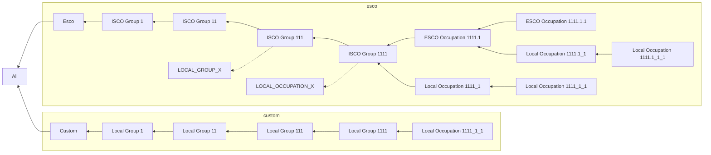

```mermaid
graph RL
    %% ISCO and ESCO
    ALL[All]
    ESCO --> ALL
    CUSTOM --> ALL
    subgraph esco
    %% ISCO/ESCO hierarchy 
        ESCO[Esco]
        ISCO_GROUP_1[ISCO Group 1]
        ISCO_GROUP_11[ISCO Group 11]
        ISCO_GROUP_111[ISCO Group 111]
        ISCO_GROUP_1111[ISCO Group 1111]
        ESCO_OCCUPATION_1111.1[ESCO Occupation 1111.1]
        ESCO_OCCUPATION_1111.1.1[ESCO Occupation 1111.1.1]
        LOCAL_OCCUPATION_1111.1_1[Local Occupation 1111.1_1]
        LOCAL_OCCUPATION_1111.1_1_1[Local Occupation 1111.1_1_1]
        LOCAL_OCCUPATION_1111_1[Local Occupation 1111_1]
        LOCAL_OCCUPATION_1111_1_1[Local Occupation 1111_1_1]
        ISCO_GROUP_1 --> ESCO
        ISCO_GROUP_11 --> ISCO_GROUP_1
        ISCO_GROUP_111 --> ISCO_GROUP_11
        ISCO_GROUP_1111 --> ISCO_GROUP_111
        ESCO_OCCUPATION_1111.1 --> ISCO_GROUP_1111
        ESCO_OCCUPATION_1111.1.1 --> ESCO_OCCUPATION_1111.1
        LOCAL_OCCUPATION_1111.1_1 --> ESCO_OCCUPATION_1111.1
        LOCAL_OCCUPATION_1111.1_1_1 --> LOCAL_OCCUPATION_1111.1_1
        LOCAL_OCCUPATION_1111_1_1 --> LOCAL_OCCUPATION_1111_1
        LOCAL_OCCUPATION_1111_1 --> ISCO_GROUP_1111
        %% Disallowed Links
        ISCO_GROUP_111 -.-> LOCAL_GROUP_X
        ISCO_GROUP_1111 -.-> LOCAL_OCCUPATION_X
    %%        ESCO_OCCUPATION_1111.1 -...-> LOCAL_GROUP_1111
    %%        ESCO_OCCUPATION_1111.1.1 -...-> LOCAL_OCCUPATION_1
    end

    subgraph custom
    %% LocalOccupation hierarchy
        CUSTOM[Custom]
        LOCAL_GROUP_1[Local Group 1] --> CUSTOM
        LOCAL_GROUP_11[Local Group 11] --> LOCAL_GROUP_1[Local Group 1]
        LOCAL_GROUP_111[Local Group 111] --> LOCAL_GROUP_11[Local Group 11]
        LOCAL_GROUP_1111[Local Group 1111] --> LOCAL_GROUP_111[Local Group 111]
        LOCAL_OCCUPATION_1[Local Occupation 1111_1_1] --> LOCAL_GROUP_1111[Local Group 1111]
    end
    
    
        
    %% Disallowed Links
        


%%linkStyle 0 stroke:#ff5733, stroke-width:2px; 


%%        C1 -.-> B4
```