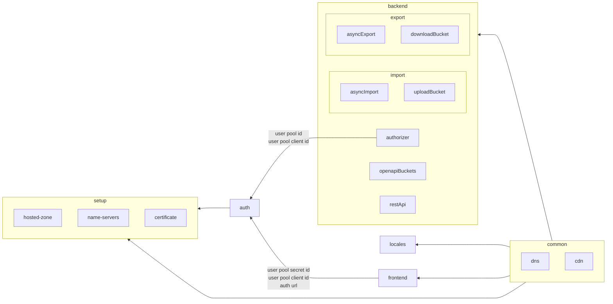

# Infrastructure as Code (IaC)

### About
This repository contains the Infrastructure as Code (IaC) configurations for deploying and managing resources on AWS using Pulumi.

Infrastructure as Code (IaC) is a method to provision and manage IT infrastructure through the use of machine-readable definition files, rather than physical hardware configuration or interactive configuration tools.

### Prerequisites 

To work IaC locally, you have to install the following:

* [Node.js ^16.0](https://nodejs.org/dist/latest-v16.x/)
* [Yarn ^1.22](https://classic.yarnpkg.com/en/) 
* A recent version of [git](https://git-scm.com/) (e.g. ^2.37 )
* [Pulumi CLI](https://www.pulumi.com/docs/install/)
* [AWS CLI](https://aws.amazon.com/cli/)

### Technologies
- [Pulumi](https://www.pulumi.com/product/)
- [AWS](https://aws.amazon.com/)
- [GitHub Actions](https://docs.github.com/en/actions)
### Getting Started
1. After cloning the repository
    ```bash
    cd iac
    ```
2. Install dependencies:
    ```bash
    yarn install
    ```
3. Configure Pulumi:
    ```bash
    pulumi login
    pulumi org set-default <name or organization> #configure the default organization if necessary
    ```
4. Add required AWS credentials (see [Pulumi AWS configuration](https://www.pulumi.com/registry/packages/aws/installation-configuration/))
5. Navigate to the desired infrastructure folder:
    ```bash
    cd backend  # or frontend/name-server
    ```
6. For testing and validating the deployment locally, run: 
    ```bash
    yarn preview
    ```
**NOTE**: Deployments are automated using GitHub Actions. In principle only the `main` branch is deployed (other branches are built but not deployed). In case you want to test the pulumi configuration from a different branch, commit the changes and add `[pulumi up]` in the  commit message. This will deploy the branch when the branch is pushed to remote.

### IaC Codebase Components 
The IaC is divided into four sub-projects.

- [Setup](setup): Sets up the fundamental infrastructure, which is a route53 hosted zone and exports environment variables that will be used by other projects. Mainly refered *to as set up env config project.
- [Name Servers](name-servers): Sets up the name servers for the subdomains.
- [Certificate](certificate): Sets up the SSL certificate infrastructure, which is an ACM certificate.
- [Auth](auth): Sets up the authentication infrastructure, which is a Cognito User Pool. and related DNS Record.
- [Locales](locales): Sets up the locales infrastructure, which is a S3 bucket for storing the locales.
- [Frontend](frontend): Sets up the frontend application's infrastructure, which is a static website hosted on S3.
- [Backend](backend): Sets up the backend application's infrastructure, which is a serverless application hosted on AWS Lambda. It also Deploys the Authorizer Lambda function.
- [Common](common): Sets up the foundational infrastructure such as DNS records, CloudFront distributions.

The projects are deployed in the following order:
 


The image below shows the solution architecture and how it relates to the IaC.


### Gotchas
- Avoid deploying changes to the infrastructure from your local machine. The deployment is automated using GitHub Actions and changes will be overwritten by the automated deployment.
- Avoid changing managed resources manually. This will cause a drift in the infrastructure's state and resources will most likely be overwritten by the automated deployment or cause unexpected errors in the system.

### Contribution
Your input in this project is greatly appreciated.

Beyond the [contribution guidelines](/README.md#contribution-guidelines), specifically the conventional commit guidelines outlined in the main directory, adhere to these particular standards when engaging with the IaC project:

- Before pushing your work, make sure to:
    - Comment your code.
    - Test the changes by running: `yarn preview`
    - Update this README for significant changes.
  
